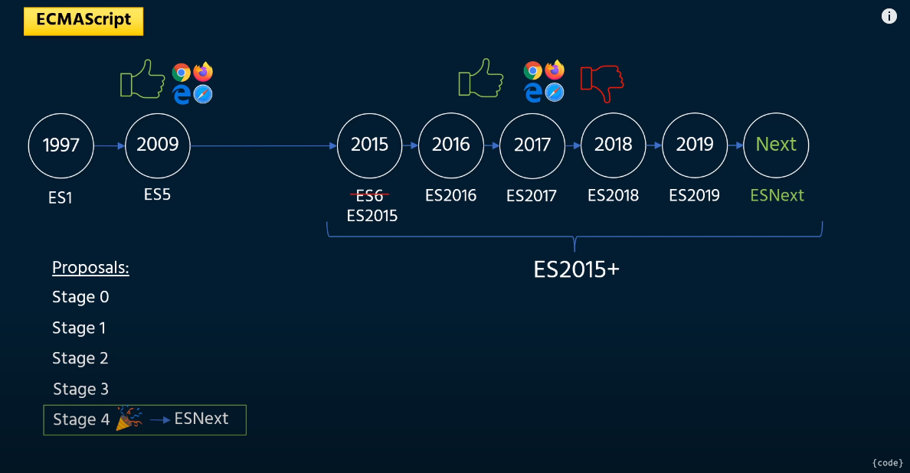
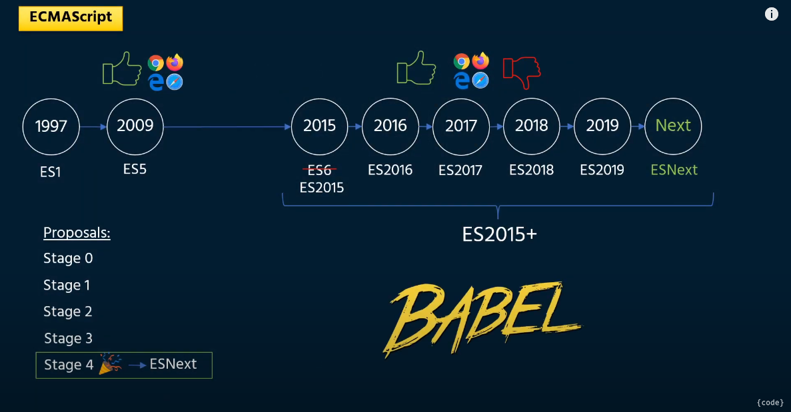
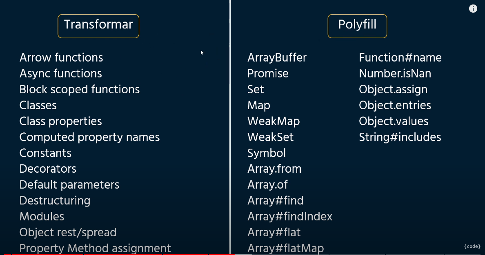

## BABEL

    - Babel es un precompilador que es usa para poder usar JS Moderno en el codigo y que los navegadores lo entiendan

    - Todos los navegadores del mercado soportan hasta cierta actualizacion de EcmaScript, Lo ultimo de EcmaScript lo van incorporando 
        poco a poco

 

  

### Install

    - Babel se actualizo y las dependencias pasaron babel/core -> @babel/core
     
        - @babel/core : Es Babel
        - @babel/cli : Dependencia para usar babel desde consola
        - @babel/preset-env : Dependencia con varios presets o configuraciones incluidas para su uso dependiendo de nuestro caso de uso
        - @babel/polyfill : Los polyfill resuelven las nuevas funciones especiales de JS que no tienen traducion a codigo standar 
            (Los agrega como librerias a nuestro codigo) 

        - Dependencias a instalar
            $ npm install -D @babel/core @babel/cli @babel/preset-env
            $ npm install @babel/polyfill

        - Crear en la carpeta raiz el archivo .babelrc y agregar el siguiente codigo.

### Polyfill

    - Los polyfill resuelven las nuevas funciones especiales de JS que no tienen traducion a codigo standar 
            (Los agrega como librerias a nuestro codigo) 

 

    - Lista de Funciones y Metodos que se pueden transformar y los Objetos globales y metodos estaticos no se puden transformar y necesitan Polyfill

 